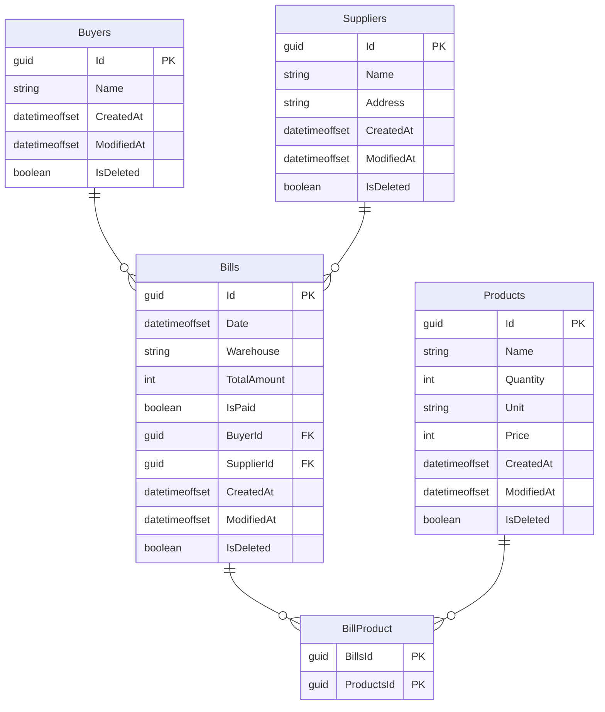

# Delivery Office API

# Тема: 
Ведение учета накладных документов для службы доставки  

# Разработал: 
 Иванов Дмитрий Андреевич ИП-21-3

## 📜 Оглавление

1. [Описание проекта](#описание-проекта)
2. [Основной функционал](#основной-функционал)
   - [Работа с поставщиками](#работа-с-поставщиками)
   - [Работа с покупателями](#работа-с-покупателями)
   - [Работа с накладными](#работа-с-накладными)
   - [Работа с товарами](#работа-с-товарами)
3. [Технологический стек](#️технологический-стек)
4. [Быстрый старт](#быстрый-старт)
   - [Клонирование репозитория](#1-клонирование-репозитория)
   - [Выполнение миграций](#2-выполните-миграции-для-создания-базы-данных)
   - [Запуск приложения](#3-запуск-приложения)
5. [ER-диаграмма и описание базы данных](#описание-структуры-базы-данных)
   - [Диаграмма](#-ER-диаграмма-базы-данных)
   - [Пример заполнения данных](#данные-для-заполнение-таблиц)

---

## 📦 Описание проекта
Delivery Office API — это RESTful API, разработанное на ASP.NET Core, предназначенное для управления накладными службы доставки. Оно позволяет эффективно работать с поставщиками, покупателями, товарами и накладными, обеспечивая гибкость и масштабируемость системы.

---

## 📚 Основной функционал

### 🔹 Работа с поставщиками
- Создание нового поставщика.
- Обновление данных о поставщике.
- Удаление поставщика.
- Получение списка поставщиков и детальной информации.

### 🔹 Работа с покупателями
- Создание нового покупателя.
- Обновление данных о покупателе.
- Удаление покупателя.
- Получение привязанных накладных.

### 🔹 Работа с накладными
- Создание нового документа.
- Обновление некоторых сведений.
- Удаление документов.
- Получение всех документов с привязанными данными (поставщики, покупатели, товары).

### 🔹 Работа с товарами
- Управление списком товаров.
- Связь товаров с накладными.

---

## ⚙️ Технологический стек

- **Платформа**: ASP.NET Core 7.0
- **ORM**: Entity Framework Core
- **База данных**: SQL Server / InMemory (для тестирования)
- **Маппинг объектов**: AutoMapper
- **Тестирование**: 
  - xUnit
  - Moq
  - FluentAssertions
- **Документация**: Swagger

---

## 🚀 Быстрый старт

### 1. Клонирование репозитория
```bash
git clone https://github.com/Mai-kun/DeliveryOfficeAPI.git
cd delivery-office-api
```

### 2. Выполните миграции для создания базы данных:
```CLI
dotnet ef database update
```

### 3. Запуск приложения
```bash
dotnet run
```
---

## Описание структуры базы данных:

### База данных состоит из следующих основных таблиц:
- **Suppliers**: информация о поставщиках.
- **Buyers**: информация о покупателях.
- **Bills**: накладные, которые связывают поставщиков и покупателей.
- **Products**: товары, связанные с накладными.

### ER-диаграмма базы данных:

### Данные для заполнение таблиц:
```SQL
INSERT INTO Suppliers (Id, Name, Address, CreatedAt, ModifiedAt, IsDeleted)
VALUES 
(NEWID(), 'Supplier A', 'Market Street, 123', GETDATE(), NULL, 0),
(NEWID(), 'Supplier B', 'Central Avenue, 456', GETDATE(), NULL, 0),
(NEWID(), 'Supplier C', 'Industrial Park, 789', GETDATE(), NULL, 0),
(NEWID(), 'Supplier D', 'Warehouse Street, 321', GETDATE(), NULL, 0),
(NEWID(), 'Supplier E', 'Outskirts Street, 654', GETDATE(), NULL, 0)
GO
INSERT INTO Buyers (Id, Name, CreatedAt, ModifiedAt, IsDeleted)
VALUES 
(NEWID(), 'Buyer 1', GETDATE(), NULL, 0),
(NEWID(), 'Buyer 2', GETDATE(), NULL, 0),
(NEWID(), 'Buyer 3', GETDATE(), NULL, 0),
(NEWID(), 'Buyer 4', GETDATE(), NULL, 0),
(NEWID(), 'Buyer 5', GETDATE(), NULL, 0);
GO
INSERT INTO Products (Id, Name, Quantity, Unit, Price, CreatedAt, ModifiedAt, IsDeleted)
VALUES 
(NEWID(), 'Product A', 100, 'pcs', 15.99, GETDATE(), NULL, 0),
(NEWID(), 'Product B', 200, 'pcs', 25.49, GETDATE(), NULL, 0),
(NEWID(), 'Product C', 300, 'pcs', 35.00, GETDATE(), NULL, 0),
(NEWID(), 'Product D', 150, 'pcs', 10.75, GETDATE(), NULL, 0),
(NEWID(), 'Product E', 250, 'pcs', 5.50, GETDATE(), NULL, 0);
GO
DECLARE @Supplier1 UNIQUEIDENTIFIER = (SELECT Id FROM Suppliers ORDER BY Id OFFSET 0 ROWS FETCH NEXT 1 ROWS ONLY);
DECLARE @Supplier2 UNIQUEIDENTIFIER = (SELECT Id FROM Suppliers ORDER BY Id OFFSET 1 ROWS FETCH NEXT 1 ROWS ONLY);
DECLARE @Supplier3 UNIQUEIDENTIFIER = (SELECT Id FROM Suppliers ORDER BY Id OFFSET 2 ROWS FETCH NEXT 1 ROWS ONLY);
DECLARE @Supplier4 UNIQUEIDENTIFIER = (SELECT Id FROM Suppliers ORDER BY Id OFFSET 3 ROWS FETCH NEXT 1 ROWS ONLY);
DECLARE @Supplier5 UNIQUEIDENTIFIER = (SELECT Id FROM Suppliers ORDER BY Id OFFSET 4 ROWS FETCH NEXT 1 ROWS ONLY);
DECLARE @Buyer1 UNIQUEIDENTIFIER = (SELECT Id FROM Buyers ORDER BY Id OFFSET 0 ROWS FETCH NEXT 1 ROWS ONLY);
DECLARE @Buyer2 UNIQUEIDENTIFIER = (SELECT Id FROM Buyers ORDER BY Id OFFSET 1 ROWS FETCH NEXT 1 ROWS ONLY);
DECLARE @Buyer3 UNIQUEIDENTIFIER = (SELECT Id FROM Buyers ORDER BY Id OFFSET 2 ROWS FETCH NEXT 1 ROWS ONLY);
DECLARE @Buyer4 UNIQUEIDENTIFIER = (SELECT Id FROM Buyers ORDER BY Id OFFSET 3 ROWS FETCH NEXT 1 ROWS ONLY);
INSERT INTO Bills (Id, Date, Warehouse, TotalAmount, IsPaid, BuyerId, SupplierId, CreatedAt, ModifiedAt, IsDeleted)
VALUES 
(NEWID(), GETDATE(), 'Warehouse A', 500.00, 1, @Buyer1, @Supplier1, GETDATE(), NULL, 0),
(NEWID(), GETDATE(), 'Warehouse B', 100.00, 0, @Buyer2, @Supplier2, GETDATE(), NULL, 0),
(NEWID(), GETDATE(), 'Warehouse C', 750.00, 1, @Buyer3, @Supplier3, GETDATE(), NULL, 0),
(NEWID(), GETDATE(), 'Warehouse D', 300.00, 0, @Buyer4, @Supplier4, GETDATE(), NULL, 0),
(NEWID(), GETDATE(), 'Warehouse E', 200.00, 1, @Buyer4, @Supplier5, GETDATE(), NULL, 0);
GO
DECLARE @Bill1 UNIQUEIDENTIFIER = (SELECT Id FROM Bills ORDER BY Id OFFSET 0 ROWS FETCH NEXT 1 ROWS ONLY);
DECLARE @Bill2 UNIQUEIDENTIFIER = (SELECT Id FROM Bills ORDER BY Id OFFSET 1 ROWS FETCH NEXT 1 ROWS ONLY);
DECLARE @Bill3 UNIQUEIDENTIFIER = (SELECT Id FROM Bills ORDER BY Id OFFSET 2 ROWS FETCH NEXT 1 ROWS ONLY);
DECLARE @Bill4 UNIQUEIDENTIFIER = (SELECT Id FROM Bills ORDER BY Id OFFSET 3 ROWS FETCH NEXT 1 ROWS ONLY);
DECLARE @Bill5 UNIQUEIDENTIFIER = (SELECT Id FROM Bills ORDER BY Id OFFSET 4 ROWS FETCH NEXT 1 ROWS ONLY);
DECLARE @Product1 UNIQUEIDENTIFIER = (SELECT Id FROM Products ORDER BY Id OFFSET 0 ROWS FETCH NEXT 1 ROWS ONLY);
DECLARE @Product2 UNIQUEIDENTIFIER = (SELECT Id FROM Products ORDER BY Id OFFSET 1 ROWS FETCH NEXT 1 ROWS ONLY);
DECLARE @Product3 UNIQUEIDENTIFIER = (SELECT Id FROM Products ORDER BY Id OFFSET 2 ROWS FETCH NEXT 1 ROWS ONLY);
DECLARE @Product4 UNIQUEIDENTIFIER = (SELECT Id FROM Products ORDER BY Id OFFSET 3 ROWS FETCH NEXT 1 ROWS ONLY);
DECLARE @Product5 UNIQUEIDENTIFIER = (SELECT Id FROM Products ORDER BY Id OFFSET 4 ROWS FETCH NEXT 1 ROWS ONLY);
INSERT INTO BillProduct (BillsId, ProductsId)
VALUES 
(@Bill1, @Product1),
(@Bill1, @Product2),
(@Bill1, @Product3),
(@Bill2, @Product4),
(@Bill2, @Product5),
(@Bill3, @Product3),
(@Bill4, @Product1),
(@Bill5, @Product5)

```
